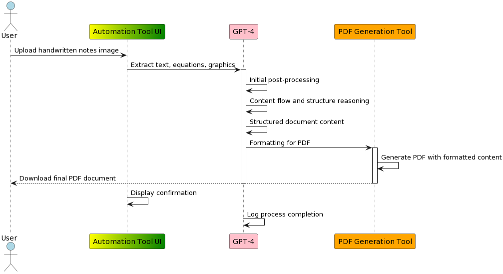

# Notes2LaTeX Project

**Ugly math hand notes --> pretty Latex**

## Overview
The Notes2LaTeX project is designed to convert handwritten notes into formatted LaTeX PDF documents. This process involves extracting text and graphical elements from images, post-processing and structuring the content using GPT-4, and finally, generating a LaTeX PDF document with the formatted content.



## Project Structure

### `/data`
- `/notes`: Holds the uploaded PDFs of handwritten notes for processing.

### `/src`
Organizes all the source code into modules by functionality.

#### `/image_processing`
- `ocr.py`: Interfaces with GPT-4V to extract text from images of handwritten notes.
- `image_utils.py`: Provides utility functions for image preprocessing, such as noise reduction, binarization, and image normalization.

#### `/text_processing`
- `text_utils.py`: Contains utilities for text processing and formatting.
- `reasoning.py`: Uses GPT-4 Turbo for logical structuring and reasoning to understand the flow and hierarchy of the document content.

#### `/pdf_generation`
- `pdf_creator.py`: Converts the structured document content into a LaTeX PDF document, handling layout and styling.

#### `/utils`
- `prompts.py`: Contains predefined prompts or templates used in various parts of the application, particularly with GPT-4 API calls.


## Setting Up the Environment

Before running the application, you need to set up the `OPENAI_API_KEY` environment variable. This key is essential for the application to interact with OpenAI's API.

1. **Obtain an API Key:**
   If you don't already have an OpenAI API key, you can obtain one by signing up or logging into your account at [OpenAI](https://openai.com/).

2. **Set the Environment Variable:**
   Set the `OPENAI_API_KEY` in your environment. This process varies depending on your operating system.

   - **On Unix/Linux/macOS:**
     ```bash
     export OPENAI_API_KEY='your-api-key'
     ```
   - **On Windows (Command Prompt):**
     ```bash
     set OPENAI_API_KEY=your-api-key
     ```
   - **On Windows (PowerShell):**
     ```powershell
     $env:OPENAI_API_KEY='your-api-key'
     ```

## Running the Application with Docker

To run the Notes2LaTeX system using Docker:

1. **Clone the repository** and navigate to the directory:

   ```bash
   git clone https://github.com/lealmilton/notes2latex.git

   cd notes2latex

2. **Start the Application**:

   ```bash
   docker-compose up

The application will be available at `http://localhost:8501`.

## Contributing
We welcome contributions to the Notes2LaTeX project! If you'd like to contribute:
- Fork the repository.
- Create a new branch for your feature or fix.
- Write or update tests as necessary.
- Submit a pull request with a clear description of your changes.

## License
Notes2LaTeX is released under the MIT License. See the `LICENSE` file for full license text.

## Contact
For support, collaboration, or inquiries, please open an issue in the GitHub repository or contact the maintainer.
